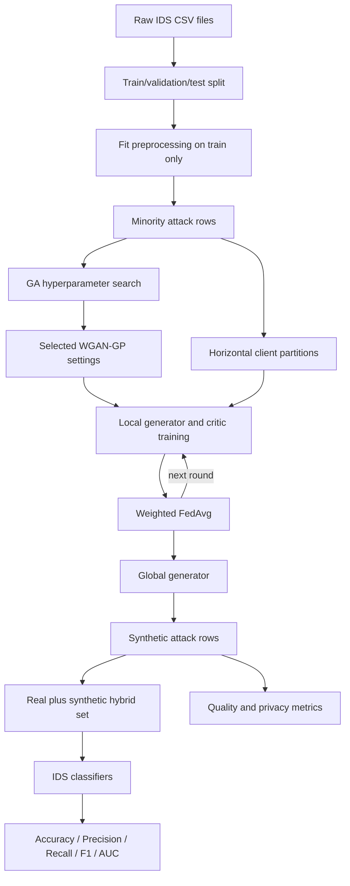

# FedGAGAN Reproduction

[](LICENSE)
[](https://www.python.org/downloads/)
[](https://doi.org/10.1109/ACCESS.2025.3547255)

Implementation of the workflow described in:

> W. Bouzeraib et al., "Enhancing IoT Intrusion Detection Systems Through
> Horizontal Federated Learning and Optimized WGAN-GP," IEEE Access, 2025,
> [DOI: 10.1109/ACCESS.2025.3547255](https://doi.org/10.1109/ACCESS.2025.3547255).

The paper does not publish source code and leaves several implementation details
unspecified. This repository therefore separates **paper-stated settings** from
explicit **reproduction choices**. It is an independent reproduction, not the
authors' original code.

## What is implemented

- Mixed tabular CSV preprocessing: mean/mode imputation, one-hot encoding, and
  min-max scaling.
- Attack-only WGAN-GP training for minority-class augmentation.
- Genetic Algorithm (GA) search using roulette selection, one-point crossover,
  real-valued mutation, elitism, and histogram KL-divergence fitness.
- Horizontal Federated Learning simulation with client-local data and
  sample-count-weighted FedAvg for both generator and critic.
- Synthetic attack generation and hybrid training-set construction.
- Statistical, correlation, privacy, PCA, and downstream IDS evaluation.
- Decision Tree, Logistic Regression, and MLP comparisons on real,
  synthetic-augmented, and hybrid training data.
- Deterministic seeds, saved resolved configuration, saved model artifacts,
  metrics, plots, and unit tests.
- Google Colab setup guidance, environment/data diagnostics, and a detailed
  troubleshooting playbook.

## Start here

- `HUONG_DAN_VI.md`: Vietnamese overview, flow, and module descriptions.
- `COLAB.md`: safe Google Colab setup and execution, including Google Drive.
- `TROUBLESHOOTING.md`: symptom, cause, fix, and recovery guidance.
- `scripts/diagnose.py`: checks Python, dependencies, GPU, configuration,
  matched CSV files, labels, and free disk space before training.

## End-to-end flow



No client raw rows are passed to the aggregation routine. This models the
training topology of horizontal FL; it does **not**, by itself, provide formal
privacy guarantees. Differential privacy and secure aggregation are outside the
paper's implemented method and outside this repository.

## Repository map

| Path | Responsibility |
|---|---|
| `src/fedgagan/config.py` | Typed YAML configuration and validation |
| `src/fedgagan/data.py` | CSV loading, label mapping, leakage-safe preprocessing, client partitioning |
| `src/fedgagan/models.py` | Generator, critic, WGAN losses, gradient penalty, local trainer |
| `src/fedgagan/genetic.py` | GA population, roulette selection, crossover, mutation, elitism |
| `src/fedgagan/aggregation.py` | Framework-independent weighted FedAvg |
| `src/fedgagan/federated.py` | Client-local training and weighted FedAvg |
| `src/fedgagan/metrics.py` | KL, correlation distance, duplicates, nearest-neighbor privacy metrics |
| `src/fedgagan/evaluation.py` | IDS utility experiments and plots |
| `src/fedgagan/pipeline.py` | Stage orchestration and artifact persistence |
| `src/fedgagan/cli.py` | `fedgagan` command-line interface |
| `configs/demo.yaml` | Small profile for an end-to-end smoke run |
| `configs/paper.yaml` | Expensive profile matching reported GA/search settings |
| `configs/datasets/` | Starting schemas for the four datasets in the paper |
| `tests/` | Configuration, partition, FedAvg, and metric tests |

## Paper traceability and implementation decisions

| Component | Paper statement | This reproduction |
|---|---|---|
| Datasets | UNSW-NB15, IoT-23, CSE-CIC-IDS2018, MQTT-IoT-IDS2020 | Generic multi-CSV loader plus starting configs for all four |
| Preprocessing | Dataset-specific imputation, encoding, normalization/standardization | Train-only fit; mean numeric imputation, mode categorical imputation, one-hot encoding, min-max scale to `[0,1]` |
| Latent size | 32 | 32 |
| Output size | 49 in the illustrated experiment | Inferred from the encoded dataset so all four datasets work |
| Generator | Four dense hidden layers, ReLU; layer sizes adjustable | `[128, 512, 512, 128]`, ReLU hidden layers |
| Generator output | Text says ReLU for all layers; validity constraints are not described | Sigmoid by default because preprocessed features are in `[0,1]`; configurable |
| Critic | Same number of layers as generator, with dropout | `[128, 512, 512, 128]`, LeakyReLU, dropout 0.2, linear scalar output |
| Batch normalization | Not used in critic | Not used in critic or generator |
| Gradient penalty | WGAN-GP; weight included in GA algorithm | Correct interpolated-sample GP; default weight 10, searchable `[1,20]` |
| Initial GA chromosome | `[0.0001, 64, 10000, 0.5, 0.9, 5]` | Same defaults, with gradient-penalty weight added because Algorithm 1 lists it |
| GA ranges | LR `[1e-5,1e-3]`, batch `[32,512]`, epochs `[1000,50000]`, betas, `n_critic [1,10]` | Same ranges; batch sizes restricted to powers of two |
| GA operators | Roulette, single-point, real mutation, elitism | Implemented |
| GA budget | Population 250, crossover 0.60, mutation 0.10, 20 generations | In `paper.yaml`; smaller disabled GA in demo profile |
| GA fitness | KL divergence after 300 GAN iterations | Mean per-feature histogram KL after 300 update steps in paper profile |
| Federated training | Horizontal clients, model updates, FedAvg, multiple rounds | In-process simulation; weighted FedAvg by local sample count |
| Client count / rounds | Not fixed in the paper | Reproduction choice: 5 clients, 10 rounds, fully configurable |
| Local epochs | Paper says clients train for multiple epochs but gives no FL-specific value | `local_epochs: null` uses the GA-selected WGAN epoch gene; an integer overrides it |
| Synthetic counts | 15k / 12.5k / 18k / 10k by dataset | `synthetic_samples` config; paper profile defaults to 15k for UNSW-NB15 |
| Evaluation | Means/STDs, PCA/t-SNE, duplicates, nearest neighbor, correlations, classifier F1 | Means/STDs, PCA, duplicates, nearest neighbor, KL, correlation RMSE/MAE, five IDS metrics |

The paper's printed "Federated Averaging Algorithm" appears to repeat GA steps
instead of specifying the actual FedAvg equations. This implementation uses the
standard sample-count-weighted average:

$$
  w_{t+1} = \sum_{k \in S_t} \frac{n_k}{\sum_j n_j} w_{t+1}^{(k)}.
$$

Generator and critic tensors are aggregated separately.

## Environment setup

Python 3.10 or 3.11 is recommended. TensorFlow availability depends on your OS
and accelerator setup.

```bash
python -m venv .venv
source .venv/bin/activate            # Windows: .venv\Scripts\activate
python -m pip install --upgrade pip
python -m pip install -e ".[dev]"
```

Check the installation:

```bash
python -m pytest
python -m fedgagan --help
python scripts/diagnose.py --config configs/demo.yaml
```

## Fast reproducibility check

This creates an imbalanced, mixed-type IDS-like dataset and runs the whole
pipeline in a few local training steps:

```bash
python -m fedgagan make-demo-data --output data/raw/demo.csv --rows 2400
python -m fedgagan run --config configs/demo.yaml \
  --stages preprocess,train,generate,evaluate
```

Outputs are written to `artifacts/demo/`:

```text
artifacts/demo/
├── resolved_config.yaml
├── data_summary.json
├── prepared/
│   ├── splits.npz
│   └── preprocessor.joblib
├── models/
│   ├── generator.keras
│   └── critic.keras
├── federated_history.json
├── synthetic_attacks.npy
├── synthetic_attacks_encoded.csv
├── distribution_metrics.json
├── classifier_metrics.csv
└── plots/
    ├── means_and_stds.png
    └── pca_real_vs_synthetic.png
```

## Run on a real dataset

### 1. Put CSV files under `data/raw`

Example for UNSW-NB15:

```text
data/raw/UNSW-NB15/
├── UNSW_NB15_training-set.csv
└── UNSW_NB15_testing-set.csv
```

The paper does not specify exact source files or a canonical preprocessing
script. Dataset releases differ, so inspect the columns and update these fields
in a copied config:

```yaml
data:
  paths: [data/raw/UNSW-NB15/*.csv]
  label_column: label
  attack_values: [1]
  drop_columns: [id, attack_cat]
```

`attack_values` contains every raw label that should map to binary attack `1`.
All other label values become benign `0`. The loader stops with observed label
counts if that mapping does not produce both classes.

### 2. Start with a feasibility profile

Do not begin with the full 250 × 20 GA. Copy `configs/paper.yaml`, then initially
use:

```yaml
train:
  epochs: 20
  steps_per_epoch: 100
federated:
  rounds: 5
ga:
  population_size: 12
  generations: 5
  evaluation_steps: 100
evaluation:
  synthetic_samples: 2000
```

### 3. Run by stages

```bash
fedgagan run --config configs/my_unsw.yaml --stages preprocess
fedgagan run --config configs/my_unsw.yaml --stages search
fedgagan run --config configs/my_unsw.yaml --stages train
fedgagan run --config configs/my_unsw.yaml --stages generate,evaluate
```

Stage outputs are reusable. Re-running later stages loads the prepared arrays,
GA result, or saved generator from the output directory.

## Module details

### Data preparation

The split occurs before fitting imputers, encoders, or scalers, preventing test
information from leaking into the training transform. The WGAN receives only
encoded attack rows from the training split. Evaluation always uses the held-out
real test split.

The included `IoT-23` and `MQTT-IoT-IDS2020` YAML files are schema templates,
not guaranteed drop-in mappings: releases and community conversions use
different column names. Raw PCAP/Zeek logs must first be converted to a tabular
CSV. The paper describes this feature extraction but does not provide code.

### WGAN-GP

For each critic update:

$$
L_D = E[D(\tilde{x})] - E[D(x)] + \lambda E[(\|\nabla_{\hat{x}}D(\hat{x})\|_2 - 1)^2].
$$

For each generator update:

$$
L_G = -E[D(G(z))].
$$

The implementation trains the critic `n_critic` times before every generator
step and uses Adam with GA-searchable learning rate, beta 1, and beta 2.

### Genetic search

One individual stores:

```text
[learning_rate, batch_size, epochs, beta_1, beta_2,
 n_critic, gradient_penalty_weight]
```

Lower KL is better. Roulette weights are converted to `1 / (1 + shifted_KL)`
so the selection probabilities are positive. The reported `epochs` gene is
used as the client training epoch count when `federated.local_epochs` is `null`;
an explicit local-epoch value overrides it. GA fitness itself uses exactly
`ga.evaluation_steps` update batches, matching the paper's stated 300-iteration
compromise.

### Horizontal federated training

Each selected client receives identical global model weights, trains on only
its local partition, then returns generator and critic parameters. The server
weights each update by the client's number of local rows. Both IID and
Dirichlet-size partitions are supported. The latter simulates unequal client
volumes, not label skew, because the GAN partition contains attack rows only.

### Evaluation

The repository reports:

- Mean per-feature histogram KL divergence.
- Correlation-matrix RMSE and MAE.
- Mean absolute differences in feature means and standard deviations.
- Exact duplicate count between real and generated attack rows.
- Mean and standard deviation of nearest-real-neighbor distance.
- Accuracy, precision, recall, F1, and ROC AUC for three classifiers.

The "synthetic" classifier scenario means generated attack rows plus real
benign rows. This explicit construction is necessary because an IDS cannot be
trained using an attack-only single-class table.

## Reproducing all four datasets

Use one complete config per dataset and change the target synthetic count:

| Dataset | Paper synthetic attack count | Paper total rows after augmentation |
|---|---:|---:|
| UNSW-NB15 | 15,000 | 450,000 |
| IoT-23 | 12,500 | 320,000 |
| CSE-CIC-IDS2018 | 18,000 | 500,000 |
| MQTT-IoT-IDS2020 | 10,000 | 250,000 |

Run each dataset into a separate `output_dir`. Do not fit one shared
preprocessor across datasets because their feature spaces differ.

## Known limits

- The authors' exact layer tensor sizes are not fully recoverable from the PDF;
  the four-hidden-layer widths are a documented reproduction choice.
- The exact number of clients, FL rounds, local epochs, selected-client fraction,
  and client data partition are absent from the paper.
- One-hot columns are generated as continuous values. For downstream use they
  remain in encoded feature space; a categorical projection strategy can be
  added if human-readable raw rows are required.
- FL without secure aggregation or differential privacy can leak information
  through model updates. This project must not be described as formally private.
- Full paper-scale GA is extremely expensive: 5,000 candidate evaluations, each
  with 300 WGAN update steps.
- Exact numerical replication of the paper tables is not possible without the
  authors' code, precise raw files/splits, and omitted experimental details.

For installation errors, GPU/OOM issues, invalid labels, NaN loss, slow GA,
Colab disconnections, and evaluation problems, see `TROUBLESHOOTING.md`.

## Recommended experiment protocol

1. Lock dataset versions and record checksums.
2. Run the demo and tests.
3. Validate label mapping and class counts after preprocessing.
4. Run a reduced GA and inspect loss/quality metrics.
5. Increase the budget only after stable training is confirmed.
6. Run at least five random seeds and report mean ± standard deviation.
7. Compare real-only, synthetic-augmented, and hybrid scenarios on the same
   untouched real test set.
8. Report both utility and privacy-proxy metrics; do not report accuracy alone.

## License and citation

The reproduction code is MIT licensed. The source paper and original datasets
remain governed by their respective licenses.

**Cite the original paper** when using the method or this reproduction:

```bibtex
@article{bouzeraib2025fedgagan,
  title   = {Enhancing IoT Intrusion Detection Systems Through Horizontal
             Federated Learning and Optimized WGAN-GP},
  author  = {Bouzeraib, W. and others},
  journal = {IEEE Access},
  year    = {2025},
  doi     = {10.1109/ACCESS.2025.3547255}
}
```

A machine-readable citation file is provided as [`CITATION.cff`](CITATION.cff)

